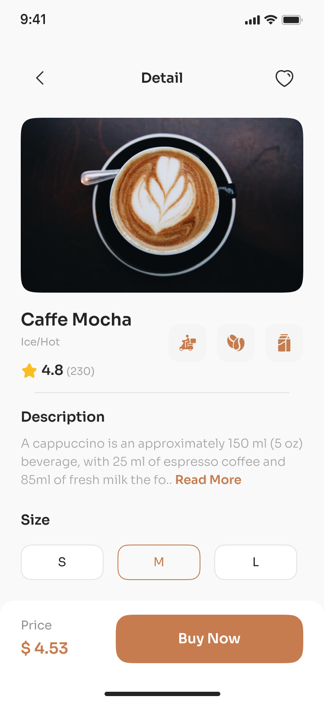
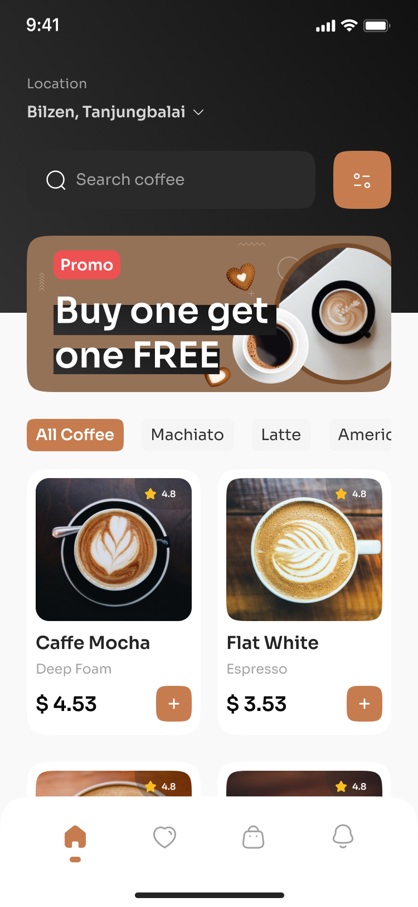
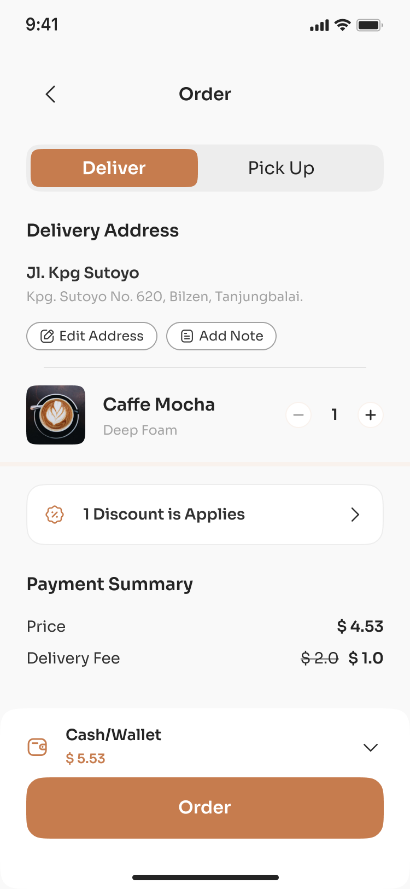

# 🍵 Coffee App - Flutter UI

A beautifully designed and responsive Flutter app for a coffee shop experience. Built using *
*flutter\_hooks** for state management, this app simulates a modern coffee ordering experience with
clean UI, elegant navigation, and user-friendly interaction patterns.

## 🌐 Live Preview

<p align="center">
  
  
  
  
  
</p>

---

## ✨ Features

* 📍 Location-aware UI (e.g., Bilzen, Tanjungbalai)
* 🔍 Interactive search bar with styled filters
* 🌟 Highlighted promotions (Buy one get one FREE)
* 🍵 Product cards with star rating and add-to-cart
* 🛒 Shopping experience with checkout summary
* 🛍️ Delivery tracking screen
* 🚀 Smooth onboarding screen with call to action

---

## 📉 Tech Stack

* Flutter 3.x
* Dart
* flutter\_hooks for lightweight reactive state management
* nb\_utils for convenience utilities

---

## ⚡ Getting Started

### 1. Clone the Repository

```bash
git clone https://github.com/SALAHADEEN-DEV/coffee_app.git
cd coffee_app
```

### 2. Install Dependencies

```bash
flutter pub get
```

### 3. Run the App

```bash
flutter run
```

Make sure you have a device or emulator running.

---

## 📚 Folder Structure

```bash
lib/
├── main.dart
├── screens/
│   ├── coffee_shop_home.dart
│   ├── splash_screen.dart
│   ├── order_screen.dart
│   └── delivery_tracking_screen.dart
├── widgets/
│   ├── product_card.dart
│   ├── category_tab.dart
│   └── bottom_navigation.dart
```

---

## 🌟 Credits

* UI inspired by real-world coffee shop apps and design systems.
* Assets and screenshots are illustrative.

---

## 🚀 Roadmap

* [ ] Firebase integration for real orders
* [ ] Dark mode toggle
* [ ] Add animations and transitions
* [ ] Favorite products & profile

---

## ✉️ Contact

Created with ❤️ by [@SALAHADEEN-DEV](https://github.com/SALAHADEEN-DEV)

Feel free to fork or contribute!
